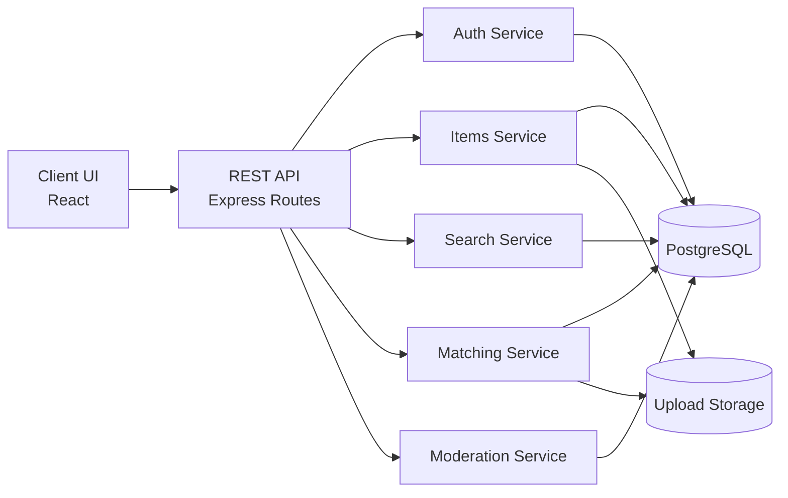
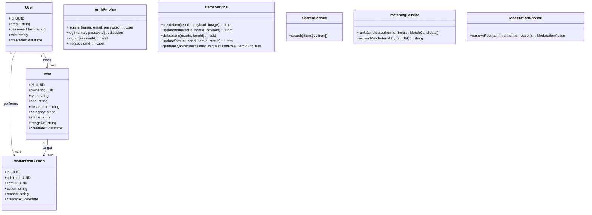
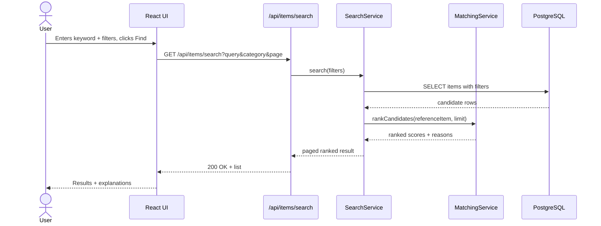
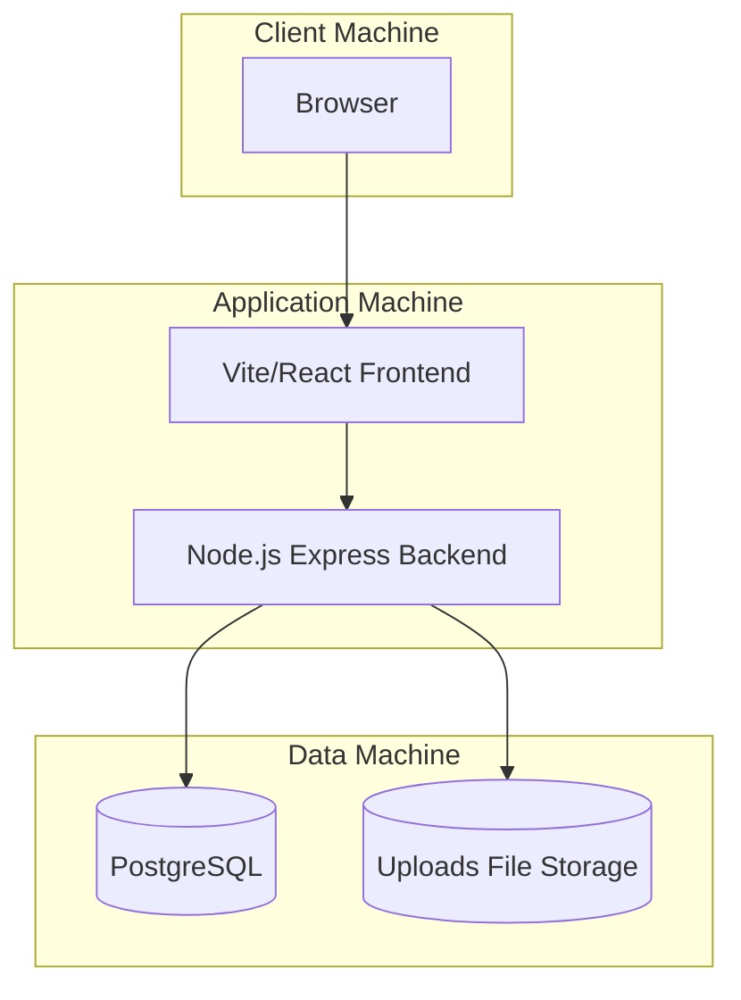

# 04 - UML Representation (Mandatory)

This document presents the selected Layered Monolithic Architecture with high-level UML diagrams.

## 1) Component Diagram

## 2) Class Diagram

## 3) Sequence Diagram

Use case: A user performs a search and views matched listings.

## 4) Deployment Diagram

## UML Scope Note
These diagrams provide a high-level representation for the first phase. Internal component details will be expanded in later iterations.
