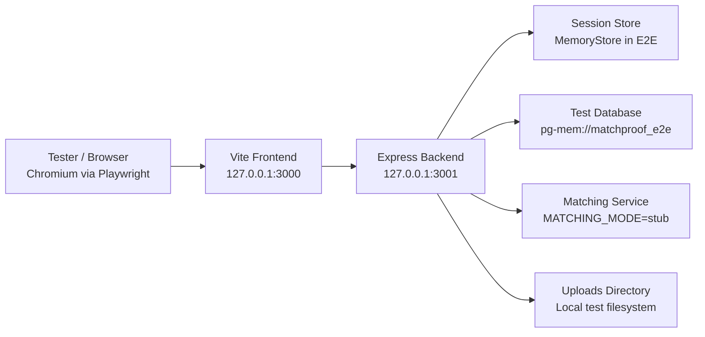

# MatchProof Test Report

## Contributors

- Mehmet Gür

## Table of Contents

- [1. Test Responsibility](#1-test-responsibility)
- [2. Test Date](#2-test-date)
- [3. Test Configuration](#3-test-configuration)
- [4. Test Inputs and Results](#4-test-inputs-and-results)
- [5. Fixed Issues](#5-fixed-issues)
- [6. Deployment Diagram](#6-deployment-diagram)
- [7. Notes](#7-notes)

## 1. Test Responsibility

| Role | Responsible |
| --- | --- |
| Test Responsible | Mehmet Gür |
| Test Report Author | Mehmet Gür |

## 2. Test Date

| Item | Value |
| --- | --- |
| Test Execution Date | `2026-04-02` |
| Latest Full Verification Run | `cmd.exe /c npm run test:all` |

## 3. Test Configuration

| Configuration Item | Value |
| --- | --- |
| Backend Unit/Integration Tool | Jest + Supertest |
| Frontend Component Test Tool | Jest + React Testing Library |
| End-to-End Test Tool | Playwright |
| Frontend Runtime | Vite |
| Backend Runtime | Node.js + Express |
| Database for E2E | `pg-mem://matchproof_e2e` |
| Session Strategy in E2E | In-memory session store |
| AI Test Mode | `MATCHING_MODE=stub` |
| Frontend Base URL | `http://127.0.0.1:3000` |
| Backend Base URL | `http://127.0.0.1:3001` |
| Browser Used for E2E | Chromium (Playwright) |

## 4. Test Inputs and Results

### 4.1 Executed Commands

| Command | Purpose | Result | Duration |
| --- | --- | --- | --- |
| `cmd.exe /c npm run test:unit` | Backend + frontend Jest suites | Passed | ~9.22s |
| `cmd.exe /c npm run test:e2e` | Browser-level end-to-end validation | Passed | ~12.4s |
| `cmd.exe /c npm run test:all` | Full combined verification pipeline | Passed | ~20.1s |

### 4.2 Test Inputs

| Input Group | Input |
| --- | --- |
| Seeded Users | `admin@matchproof.test`, `owner@matchproof.test` |
| Seeded Passwords | `Password123!` |
| Seeded Open Match Fixture | `Found Black Wallet Near Library` |
| Seeded Moderation Fixture | `Moderation Target Wallet` |
| Seeded Removed Fixture | `Removed Headphones Listing` |
| Dynamic E2E User | `student.<timestamp>@matchproof.test` |
| Dynamic E2E Post Title | `E2E Black Wallet <timestamp>` |

### 4.3 Test Results

| Test Scope | Input / Scenario | Expected Result | Actual Result | Status |
| --- | --- | --- | --- | --- |
| Backend Route Contract | Auth, items, moderation endpoints | Error and success contracts remain stable | Contracts matched expected responses | Passed |
| Backend Business Rules | Status transitions, removed item visibility, moderation authorization | Only valid transitions and permissions allowed | Rules enforced correctly | Passed |
| Frontend Component | Search pagination and detail match rendering | UI triggers correct API calls and renders state correctly | Component behavior matched expected output | Passed |
| E2E Flow 1 | Register → login → create lost post → search → detail → matches → status updates | Full user flow completes without failure | Flow completed successfully | Passed |
| E2E Flow 2 | Admin login → moderation panel → remove seeded post | Admin can remove post with reason | Moderation flow completed successfully | Passed |

## 5. Fixed Issues

| ID | File | Issue | Fix Applied | Status |
| --- | --- | --- | --- | --- |
| T-01 | `tests/server/routes/api.routes.integration.test.js` | Delete route test expected outdated error code `NOT_ITEM_OWNER`. | Expectation aligned with actual backend contract `ITEM_OWNERSHIP_REQUIRED`. | Fixed |
| T-02 | `tests/server/routes/api.routes.integration.test.js` | Moderation route test expected outdated error code `MODERATION_REASON_REQUIRED`. | Expectation aligned with actual backend contract `INVALID_REASON`. | Fixed |
| T-03 | `tests/server/routes/api.routes.integration.test.js` | `/api/items/:itemId/matches` route was not covered in route-level tests. | Added route test and matching-service mock coverage. | Fixed |
| T-04 | `tests/server/services/items.service.test.js` | Unit test file pulled in matching logic indirectly and was less isolated than intended. | Added explicit `matchingService` mock to keep the suite focused on `items.service`. | Fixed |
| T-05 | `tests/client/pages/AuthPage.test.jsx`, `tests/client/pages/SearchPage.test.jsx` | Frontend tests could hide missing real modules by relying on virtual mocks. | Removed virtual dependency masking so missing real frontend modules surface during tests. | Fixed |
| T-06 | `tests/server/routes/api.routes.integration.test.js` | Expected error-path tests produced noisy `console.error` output during normal test runs. | Added scoped `console.error` spy/mute for the route integration suite. | Fixed |
| T-07 | `package.json`, `playwright.config.cjs`, `tests/e2e/` | Repo had no real browser-level end-to-end verification. | Added Playwright E2E runner, scripts, config, and seeded full-flow tests. | Fixed |
| T-08 | `scripts/e2e/reset-and-seed.js`, `scripts/e2e/start-backend.js`, `src/server/index.js`, `src/server/services/migrate.js` | E2E environment lacked deterministic backend startup, seed data, and reusable migration flow. | Added seeded E2E startup path and reusable migration execution with optional pool reuse. | Fixed |
| T-09 | `src/server/services/db.js`, `src/server/services/session-store.js`, `src/server/services/matchingService.js` | E2E tests needed deterministic DB + AI behavior without external PostgreSQL/model downloads. | Added `pg-mem` test database support, memory session store for test mode, and `MATCHING_MODE=stub`. | Fixed |
| T-10 | `src/client/pages/*.jsx`, `tests/client/pages/SearchPage.test.jsx`, `tests/client/pages/DetailPage.test.jsx` | E2E selectors and component coverage were too weak for stable browser tests. | Added stable test hooks/labels and extended component coverage for pagination and match rendering. | Fixed |

## 6. Deployment Diagram

## 7. Notes

- Full verification was completed successfully after the fixes.
- No failing backend, frontend, or E2E tests remained in the latest run.
- The E2E layer uses deterministic seed data and stubbed AI matching to keep browser tests stable.
