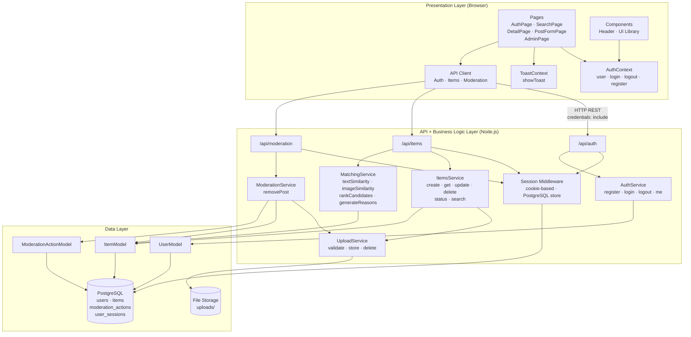
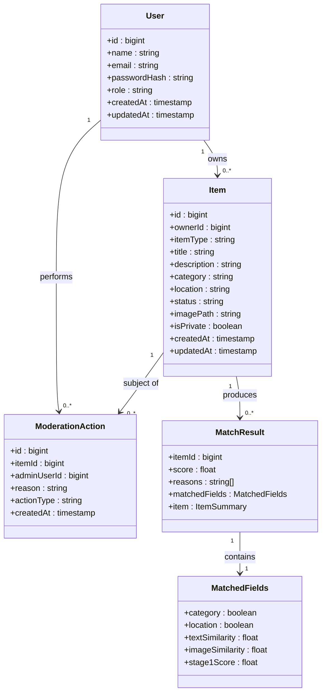
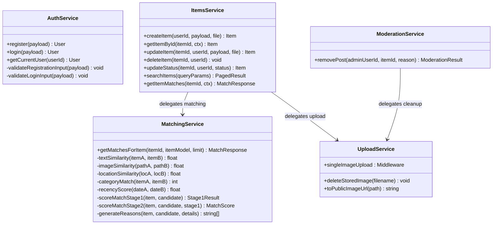
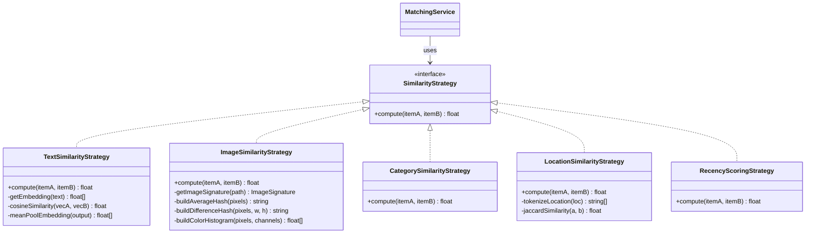
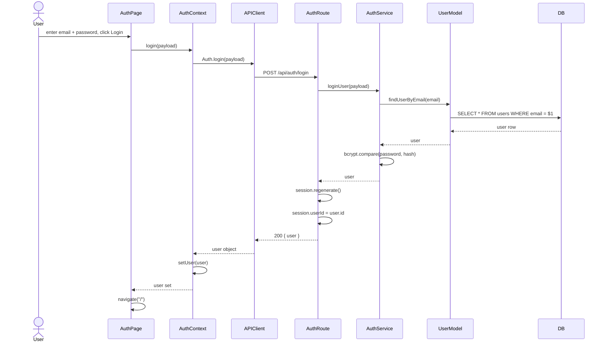
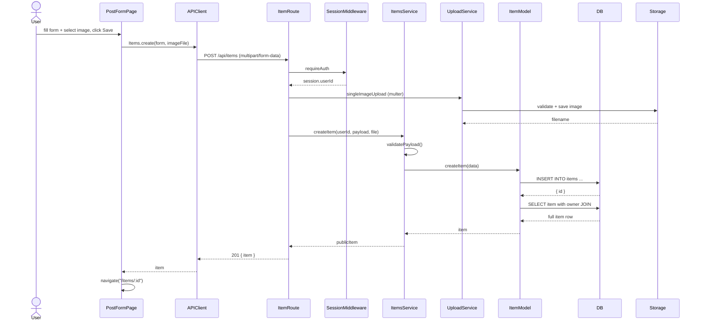
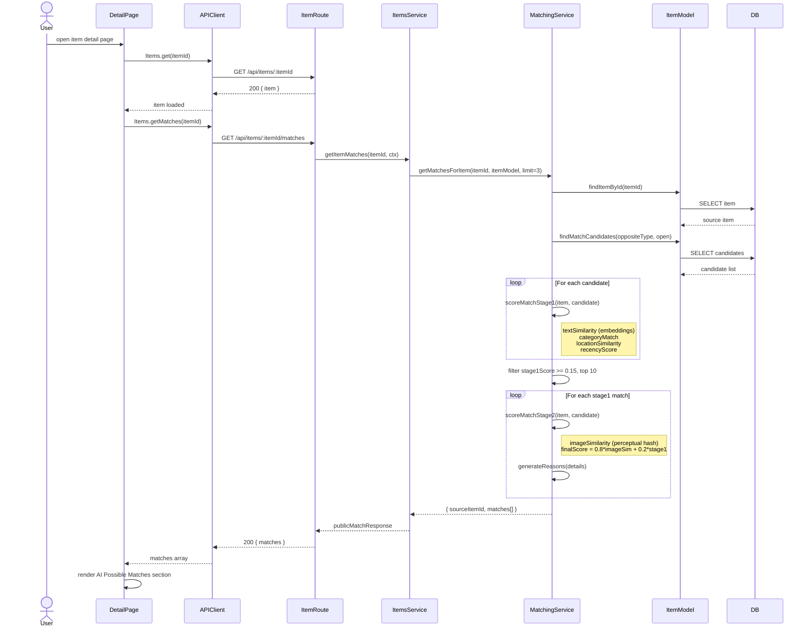
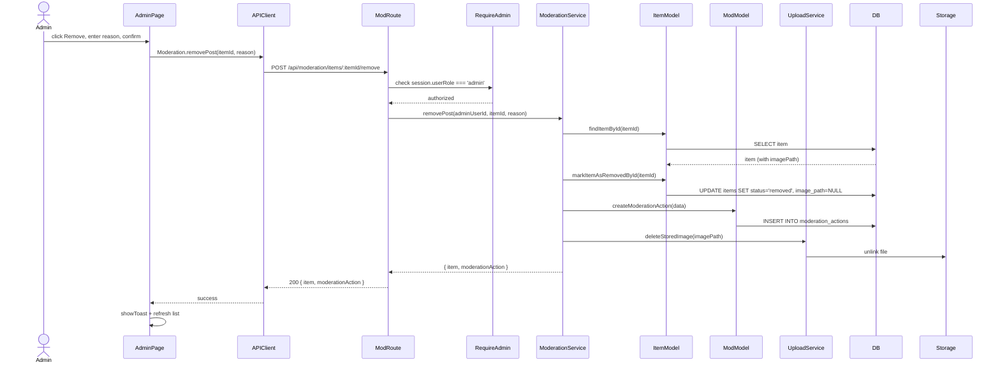
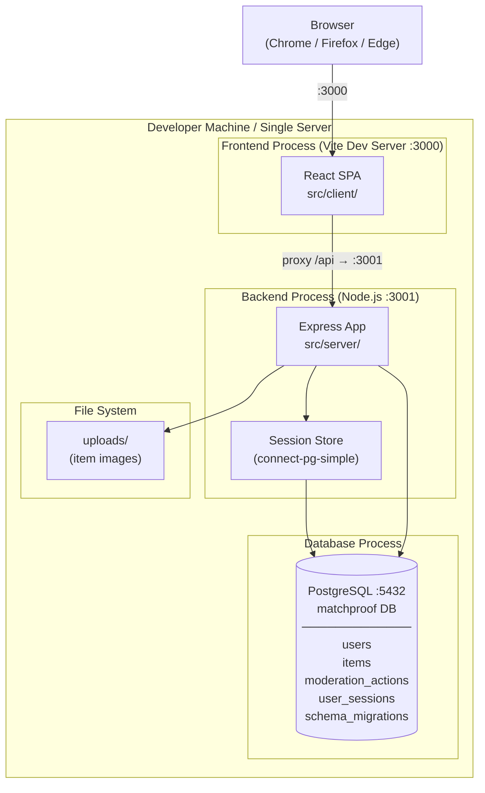

# MatchProof – Software Architecture Document

**Project Name:** MatchProof
**Course:** BIL 481
**Version:** 1.0
**Date:** 2026-02-20

## List of Contributors

### Team Members
- Mehmet Gür
- Zehra Atalay
- Elif Beyza Turan
- Yiğit Yıldız
- Alp Eren Köksal

### Contributors to this document
- Elif Beyza Turan
- Alp Eren Köksal

---

## Table of Contents

1. [Architecture Style](#1-architecture-style)
2. [System Overview](#2-system-overview)
3. [Component Diagram](#3-component-diagram)
4. [Class Diagram](#4-class-diagram)
5. [Sequence Diagrams](#5-sequence-diagrams)
6. [Deployment Diagram](#6-deployment-diagram)
7. [Component Interfaces](#7-component-interfaces)

---

## 1. Architecture Style

### Selected Architecture: Layered Monolith

MatchProof uses a **Layered (N-Tier) Monolithic Architecture** organized into four distinct layers:

| Layer | Responsibility |
|---|---|
| **Presentation Layer** | React SPA — user interface, routing, state management |
| **API Layer** | Express.js REST endpoints — request handling, auth guards |
| **Business Logic Layer** | Service modules — validation, authorization, AI matching |
| **Data Access Layer** | Model modules — SQL queries, database interaction |

### Why Layered Monolith?

| Factor | Decision |
|---|---|
| Team size | 5 members — single deployment unit is manageable |
| Timeline | 10-week project — microservices overhead not justified |
| Complexity | Course-scoped system — distributed tracing/service mesh unnecessary |
| Extensibility | Layers are independently modifiable; AI module is isolated as a service |

This architecture aligns with the Assignment 2 design decision rationale: maintainability and demonstrability are prioritized over distributed-system complexity.

---

## 2. System Overview

```
Browser
  │
  ▼
React SPA (src/client/)
  │  AuthContext · ToastContext · React Router
  │  Pages: Auth · Search · PostForm · Detail · Admin
  │  API Client (fetch + credentials)
  │
  ▼  HTTP / REST (port 3000 → proxy → 3001)
Express Server (src/server/)
  │  Session middleware · CORS · Multer
  │  Routes: /api/auth · /api/items · /api/moderation
  │
  ▼
Service Layer
  │  AuthService · ItemsService · SearchService
  │  MatchingService · ModerationService · UploadService
  │
  ▼
Model Layer
  │  UserModel · ItemModel · ModerationActionModel
  │
  ▼
PostgreSQL Database          File Storage (uploads/)
```

---

## 3. Component Diagram



---

## 4. Class Diagram

### 4.1 Core Domain Entities



### 4.2 Service Layer



### 4.3 AI Matching – Strategy Pattern



---

## 5. Sequence Diagrams

### 5.1 User Login



### 5.2 Create Lost/Found Post



### 5.3 AI-Assisted Match



### 5.4 Admin Remove Post



---

## 6. Deployment Diagram



> **Note:** This deployment reflects the current development setup. Both frontend and backend run on the same machine. A production deployment would place the built React bundle behind a static file server (e.g., nginx) and run the Node.js backend as a separate process, both pointing to the same PostgreSQL instance.

---

## 7. Component Interfaces

### 7.1 API Client → Backend

All requests use `credentials: 'include'` for session cookie propagation.

| Interface | Input | Output |
|---|---|---|
| `Auth.register(payload)` | `{ name, email, password }` | `{ user }` |
| `Auth.login(payload)` | `{ email, password }` | `{ user }` |
| `Auth.logout()` | — | `204 No Content` |
| `Auth.me()` | — | `{ user }` |
| `Items.search(filters)` | `{ query, category, itemType, status, dateFrom, dateTo, page, pageSize }` | `{ items[], pagination, filters }` |
| `Items.get(itemId)` | `itemId: string` | `{ item }` |
| `Items.create(data, imageFile)` | `FormData { itemType, title, category, location, description, image? }` | `{ item }` |
| `Items.update(itemId, data, imageFile)` | `FormData (partial fields + image?)` | `{ item }` |
| `Items.delete(itemId)` | `itemId: string` | `204 No Content` |
| `Items.updateStatus(itemId, status)` | `{ status: 'claimed' \| 'resolved' }` | `{ item }` |
| `Items.getMatches(itemId)` | `itemId: string` | `{ sourceItemId, sourceItemType, matches[] }` |
| `Moderation.removePost(itemId, reason)` | `{ reason: string }` | `{ item, moderationAction }` |

### 7.2 Service Layer Interfaces

| Service | Method | Input | Output |
|---|---|---|---|
| AuthService | `registerUser(payload)` | `{ name, email, password }` | `User` |
| AuthService | `loginUser(payload)` | `{ email, password }` | `User` |
| AuthService | `getCurrentUser(userId)` | `userId: number` | `User` |
| ItemsService | `createItem({ userId, payload, file })` | userId, validated fields, optional file | Public `Item` |
| ItemsService | `getItemById(itemId, { userId, userRole })` | itemId, auth context | Public `Item` |
| ItemsService | `searchItems(queryParams)` | filter params | `{ items[], pagination, filters }` |
| ItemsService | `updateStatus({ itemId, userId, status })` | itemId, userId, next status | Public `Item` |
| ItemsService | `updateItem({ itemId, userId, payload, file })` | itemId, userId, partial update | Public `Item` |
| ItemsService | `deleteItem({ itemId, userId })` | itemId, userId | `void` |
| ItemsService | `getItemMatches({ itemId, userId, userRole })` | itemId, auth context | Match response |
| MatchingService | `getMatchesForItem({ itemId, itemModel, limit })` | itemId, model ref, limit | `{ sourceItemId, sourceItemType, matches[] }` |
| ModerationService | `removePost({ adminUserId, itemId, reason })` | adminId, itemId, reason string | `{ item, moderationAction }` |

### 7.3 Data Models

| Model | Key Methods |
|---|---|
| UserModel | `createUser`, `findUserByEmail`, `findUserById` |
| ItemModel | `createItem`, `findItemById`, `searchItems`, `updateItemById`, `updateItemStatusById`, `markItemAsRemovedById`, `deleteItemById`, `findMatchCandidates` |
| ModerationActionModel | `createModerationAction` |
